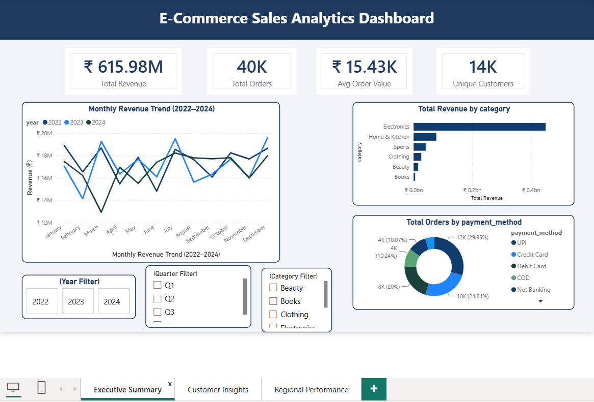

# E-Commerce Sales Analytics Dashboard

## Overview
End-to-end data analytics project analyzing 50,000+ e-commerce 
transactions across 3 years (2022–2024).

## Tools Used
- Python (Pandas, Matplotlib) — EDA & data cleaning
- MySQL — 14 SQL queries including CTEs & window functions  
- Power BI — 3-page interactive dashboard

## Key Findings
- Total Revenue: ₹61.6 Crore
- Repeat Customer Rate: 80.1%
- Top Category: Electronics (₹45 Crore revenue)
- UPI is #1 payment method (30% of orders)
- Return Rate: 9.22%

## Files
- `eda_analysis.py` — Python EDA script
- `ecommerce_sql_queries.sql` — 14 SQL queries
- `Proj1.pbix` — Power BI dashboard
- `ecommerce_transactions.csv` — 50,000 row dataset

## 📸 Dashboard Preview

